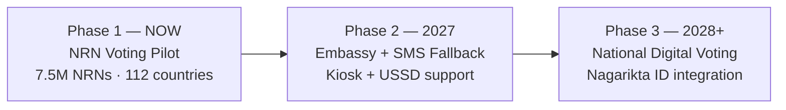

<div align="center">

# 🗳️ HamroVote — हाम्रो भोट

### *Your Vote. Your Voice. Anywhere in the World.*

🏆 **Winner — CivicCode Hackathon 2026** 🏆
*Hosted by Think Big · Certified by P4I (Partnerships for Integrity), Germany*

[](#-award)
[](#-award)
[](#-award)
[](#-roadmap)

[](#-tech-stack)
[](#-tech-stack)
[](#-tech-stack)
[](#-tech-stack)
[](#-tech-stack)
[](#-tech-stack)

</div>

---

## 🌍 The Problem

> *"Either arrangements should be made for voting at the concerned country's embassy, or voting could be facilitated through mobile devices. However, mobile voting carries a risk of influence."*
> **— PM Balen Shah, Parliament · May 31, 2026**

Nepal has **7.5 million Non-Resident Nepalis** spread across **112 countries**, contributing **$11B+ in annual remittances** — roughly **26% of GDP**. Despite that, not a single one of them can cast a vote on election day.

This isn't a technology gap. **Estonia, India, and the Philippines have already solved overseas digital voting.** Nepal hasn't — and the one real obstacle the Prime Minister himself named is **"risk of influence."** That's the exact gap HamroVote is built to close.

| Stat | Reality |
|---|---|
| 🌐 **112** | Countries with Nepali citizens who cannot vote |
| 👥 **7.5M** | Non-Resident Nepalis disenfranchised |
| 💸 **$11B+** | Annual remittances from people with zero political voice |
| 🚫 **0** | Existing systems for NRN voting in Nepal |

---

## 💡 The Solution

**HamroVote is a coercion-resistant digital voting platform** — built so that:

> 🟢 **The voter is free** · 🔴 **The coercer is powerless** · 🔵 **The outcome is verifiable**

It directly answers the Prime Minister's own "risk of influence" concern with real, working biometric safeguards — not just a registration portal.

```
   ┌──────────────────┐     ┌──────────────────┐     ┌──────────────────┐     ┌──────────────────┐
   │  1️⃣ Face          │ ──▶ │  2️⃣ Live          │ ──▶ │  3️⃣ Multi-Person  │ ──▶ │  4️⃣ Blockchain    │
   │  Verification     │     │  Voting Booth     │     │  & Emotion Check  │     │  Sealed Vote      │
   └──────────────────┘     └──────────────────┘     └──────────────────┘     └──────────────────┘
                                                                                          │
                                                                                          ▼
                                                                          ┌──────────────────────────┐
                                                                          │  📊 Party Performance     │
                                                                          │     Dashboard             │
                                                                          └──────────────────────────┘
```

---

## ✨ Core Features

### 1️⃣ Face Verification
One person. One vote. Zero impersonation. The live camera feed is matched against the photo on the voter's official Voter ID.

### 2️⃣ Live Voting Booth
The camera stays active for the full **5-minute voting window** — no switching off mid-vote, no shortcuts.

### 3️⃣ Multi-Person & Emotion Detection
If a second face enters the frame, the session is invalidated immediately. Stress cues are flagged as potential coercion signals — **this is the core safeguard the PM said was missing.**

### 4️⃣ Party Performance Dashboard
Bills passed. Budget utilized. Projects completed. Color-coded so any voter — tech-savvy or not — can understand a party's track record at a glance.

### 5️⃣ Blockchain Transparency
Every vote is sealed on the **Ethereum Sepolia testnet** — immutable, and independently auditable by any citizen.

**Plus:** browser-based, low-data design and Nepali voice guidance, built for voters on slow connections and varying literacy levels — not just engineers.

---

## 🌐 Why Other Countries Already Solved This

| Country | Approach | Scale | Status |
|---|---|---|---|
| 🇪🇪 Estonia | Digital ID + i-Voting | 200,000+ citizens abroad | ✅ Solved |
| 🇮🇳 India | Aadhaar + OTP | 35M+ overseas citizens | ✅ Solved |
| 🇵🇭 Philippines | Hybrid embassy + online | 10M+ workers abroad | ✅ Solved |
| 🇳🇵 **Nepal** | — | **7.5M NRNs** | ❌ **No system** |

The real blocker was never technology. **It's trust** — and that's exactly what HamroVote's coercion-resistance is designed to earn.

---

## 🛠️ Tech Stack

<div align="center">

| Layer | Technology |
|---|---|
| **Frontend** | React + Vite, Tailwind CSS |
| **Auth** | Firebase, Email OTP |
| **Face AI** | face-api.js, TensorFlow.js *(runs on-device)* |
| **Backend** | Node.js + Express, MongoDB Atlas |
| **Blockchain** | Ethereum Sepolia testnet, Smart Contracts |
| **Data** | Open Data Nepal API |

</div>

---

## 🗺️ Roadmap



- **Phase 1 (Now):** HamroVote prototype — exactly what's in this repo today
- **Phase 2 (2027):** Embassy kiosk integration + SMS/USSD fallback for non-smartphone users — directly answering the PM's second proposed solution
- **Phase 3 (2028+):** Full national rollout — integration with Nagarikta ID and Election Commission voter rolls, extending to provincial and local elections

---

## 📈 Market Opportunity

The global digital voting market is valued at **$4.5B in 2026**, growing at a **15% CAGR** toward a projected **$14B by 2034**. HamroVote's niche — **biometric coercion-detection for diaspora enfranchisement** — has almost no direct competition, with a clear initial market of 7.5M NRNs and a much larger regional opportunity across South Asia's broader diaspora.

---

## 🎯 Why It Matters

HamroVote maps to all four CivicCode 2026 hackathon themes:

1. 🗳️ **Doing Democracy Differently**
2. 🌍 **Designing for the Millions**
3. 💻 **Technology for Civic Good**
4. 📚 **Learn · Teach · Empower**

> **7,500,000 people across 112 countries** — more than the population of many entire nations — finally get a voice.

> *Democracy shouldn't end at the border. With HamroVote, that border disappears.*

---

## 🏆 Award

<div align="center">

### 🥇 1st Place — CivicCode 2026
**A 12-hour civic tech hackathon · Hosted by Think Big · 26 June 2026, Kathmandu, Nepal**


📁 [**View Certificate & Event Assets**](https://drive.google.com/drive/folders/19lVVWccQbezA3HaHPMvhiUKlssV12S1m?usp=sharing)

**Prize:** NRP 40,000 cash award · Official certificate from **P4I (Partnerships for Integrity), Germany**

*Certificate signed by Meredith Applegate, Co-Founder of P4I Germany*

</div>

### About CivicCode 2026
CivicCode was a 12-hour civic tech hackathon for developers, coders, and civic tech enthusiasts across Nepal, organized by **Think Big** in partnership with **P4I (Partnerships for Integrity), Germany**. Teams built functional tools for digital democracy, judged on creativity, technical execution, and real-world civic impact.

**Judges:** Laxman Bista and an American professor, both from P4I Germany's judging panel.

---

## 👥 Team

**Team ACIT**

<div align="center">

[](https://github.com/kabincs9)
[](https://github.com/pie-1)
[](https://github.com/daraiangel90-boop)
[](#)

</div>

---

## 🚀 Getting Started

```bash
# Clone the repository
git clone https://github.com/pie-1/<repo-name>.git
cd <repo-name>

# Install dependencies (frontend)
cd frontend
npm install
npm run dev

# Install dependencies (backend)
cd ../backend
npm install
npm start
```

> ⚠️ This is a **hackathon prototype** built in 12 hours. Smart contracts are deployed on **Ethereum Sepolia testnet** (not mainnet), and face verification runs on-device via TensorFlow.js for the demo. Production deployment would require security audits, Nagarikta ID integration, and Election Commission partnership.

---

<div align="center">

**Dhanyabad 🙏 — We'd love to show you a live demo.**

*Built with ❤️ for the 7.5 million Nepalis who deserve a vote.*

</div>
